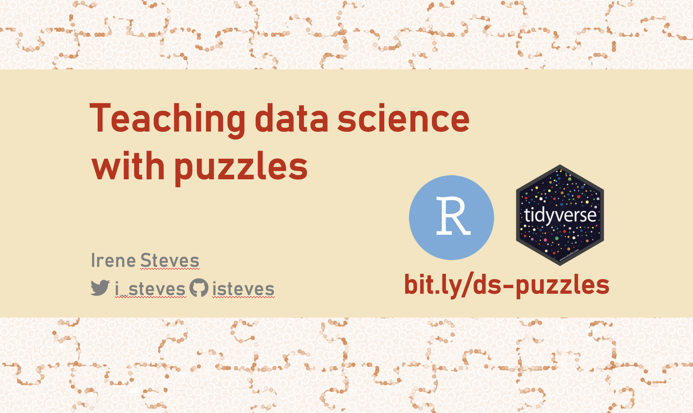

# Teaching data science with puzzles
### rstudio::conf 2019, [slides](https://speakerdeck.com/isteves/teaching-data-science-with-puzzles)

Of the many coding puzzles on the web, few focus on the programming skills needed for handling untidy data. During my summer internship at RStudio, I worked with Jenny Bryan to develop a series of data science puzzles known as the "Tidies of March." These puzzles isolate data wrangling tasks into bite-sized pieces to nurture core data science skills such as importing, reshaping, and summarizing data. We also provide access to puzzles and puzzle data directly in R through an accompanying Tidies of March package. I will show how this package models best practices for both data wrangling and project management.

If you'd like to take a closer look at the sandwiches example from the talk, check out the [sandwiches folder](https://github.com/isteves/ds-puzzles/tree/master/11_sandwiches) in this repo.

## Additional resources

- [How to name files](https://speakerdeck.com/jennybc/how-to-name-files) talk by Jenny Bryan
- [A summer of puzzles at RStudio](https://irene.rbind.io/post/summer-rstudio/) blogpost about my internship experience 
- [it’s not the maths, it’s the code - how testing has changed my workflow](http://cantabile.rbind.io/posts/2019-01-05-its-not-not-the-math-its-the-code/) blogpost by Charles T. Gray
 
Packages mentioned in my talk:

- [usethis](https://usethis.r-lib.org/) - a workflow package: it automates repetitive tasks that arise during project setup and development, both for R packages and non-package projects
- [testthat](https://testthat.r-lib.org/) - to make testing fun
- [testrmd](https://github.com/ropenscilabs/testrmd) - test chunks for RMarkdown
- [reprex](https://reprex.tidyverse.org/) - render bits of R code for sharing, e.g., on GitHub or StackOverflow
- [rmarkdown](https://rmarkdown.rstudio.com/) - create reproducible text and analyses 

## Thank yous

A big thanks to the Tidyverse team, fellow interns, and RStudio folks for a fun & interesting summer!

Also thanks to Maria Novosolov, Alex Slavenko, Alex Hayes, Steven Chong, and Julien Brun for their comments and support in early versions of this talk!
